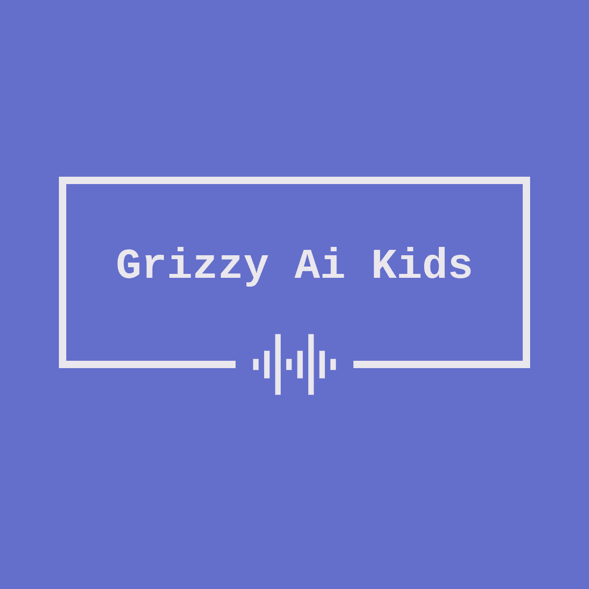

## Brain dump of the grizzy kids ai video ( text to kids video gen )

<video width="630" height="300" src="./assets/Environment.mp4"></video>

## the requirements.txt sucks

### Add this keys to a .env file

```bash
    OPENAI_API_KEY = "open ai key"
    SPEECH_KEY = "azure speech key"
    SPEECH_REGION = "azure speech region"
    IMAGEMAGICK_BINARY = C:\Program Files\ImageMagick-7.1.1-Q16-HDRI\magick.exe # relevant for windows
```

### open the main.py file and modify

```python
    if __name__ == "__main__":
        virtual = VirtualTeacherGenerator()

        """
            supported voices
            -------------------
                en-GB-SoniaNeural (Female)
                en-GB-RyanNeural (Male)
                en-GB-LibbyNeural (Female)
                en-GB-AbbiNeural (Female)
                en-GB-AlfieNeural (Male)
                en-GB-BellaNeural (Female)
                en-GB-ElliotNeural (Male)
                en-GB-EthanNeural (Male)
                en-GB-HollieNeural (Female)
                en-GB-MaisieNeural (Female, Child)
                en-GB-NoahNeural (Male)
                en-GB-OliverNeural (Male)
                en-GB-OliviaNeural (Female)
                en-GB-ThomasNeural (Male)
        """

        virtual.generate_lesson(
            title = "Climate change",
            participants = [
                Participant(name="Mr. Juma", role="teacher", gender="female", voice="en-GB-RyanNeural", avatar="teacher.png"),
                Participant(name="Brian", role="learner", gender="male", voice="en-US-AnaNeural", avatar="child.png"),
                Participant(name="Emma", role="learner", gender="female", voice="en-GB-MaisieNeural", avatar="child1.png")
            ]
        )   

```

### the video mp4 files will be generated in the same folder with the `title`.mp4 format